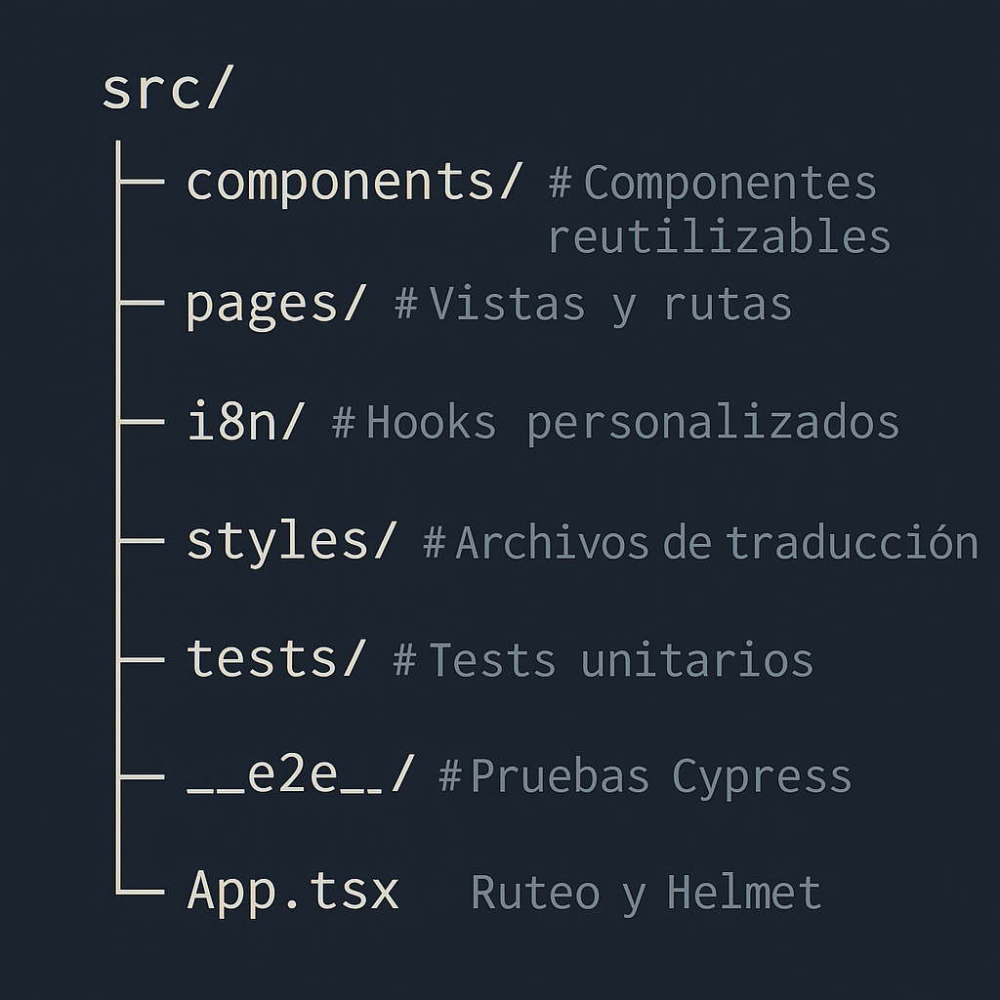

# 🚀 Invest Alerts – React Frontend

Frontend profesional para el sistema **Invest Alerts**, una app de alertas de precios de criptomonedas construida con React 19 + Vite. Este proyecto está pensado para ser **moderno, escalable y de clase mundial**, ideal como template base o para proyectos productivos reales.

---

## 📊 Badges

## 📊 Badges

---

## ✨ Features implementadas

✅ Modularización con estructura por capas  
✅ Tailwind CSS 4  
✅ Internacionalización (`i18next`, `react-i18next`)  
✅ SEO con `react-helmet-async`  
✅ Error boundaries globales  
✅ Lazy loading y `React.Suspense`  
✅ E2E testing con Cypress  
✅ Unit testing con Vitest + Testing Library  
✅ CI/CD con GitHub Actions + Vercel  
✅ Coverage automático con Coveralls  
✅ Storybook configurado para componentes  
✅ Husky + lint-staged para pre-commits  
✅ ESLint + Prettier integrados

---

## 🧰 Tecnologías principales

- ⚛️ React 19 (con TypeScript)
- ⚡ Vite
- 🌐 React Router 7
- 🎨 Tailwind CSS
- 🧪 Vitest + Testing Library
- 🧪 Cypress (E2E)
- 📚 Storybook 9
- 🌍 i18next (multi idioma)
- 🔒 Husky + lint-staged
- 💡 react-helmet-async
- 📦 Axios
- ☁️ GitHub Actions + Coveralls + Vercel

---

## 🚀 Scripts disponibles

\`\`\`bash
npm run dev         # Ejecuta la app en desarrollo
npm run build       # Compila para producción
npm run preview     # Sirve el build localmente
npm run lint        # Corre ESLint
npm run format      # Formatea con Prettier
npm run test        # Corre tests con cobertura
npm run coverage    # Genera reporte lcov
npm run e2e         # Abre Cypress
npm run storybook   # Abre Storybook en localhost:6006
\`\`\`

---

## 📁 Estructura del proyecto

---

## 🌍 i18n (idiomas)

El proyecto está preparado para internacionalización. Idiomas disponibles:

- 🇺🇸 Inglés (`en`)
- 🇪🇸 Español (`es`)

Podés agregar nuevos idiomas editando `src/locales/`.

---

## 🧪 Tests y cobertura

- Tests unitarios se ejecutan con `Vitest`
- E2E tests con `Cypress`
- Cobertura publicada automáticamente en [Coveralls](https://coveralls.io/github/marcoslozina/invest-alerts-reactive-frontend)

---

## 📦 Deploy automático

El proyecto se despliega automáticamente en [Vercel](https://vercel.com/dashboard), al hacer push a `main`.

---

## 📄 Licencia

MIT © [Marcos Lozina](https://github.com/marcoslozina)